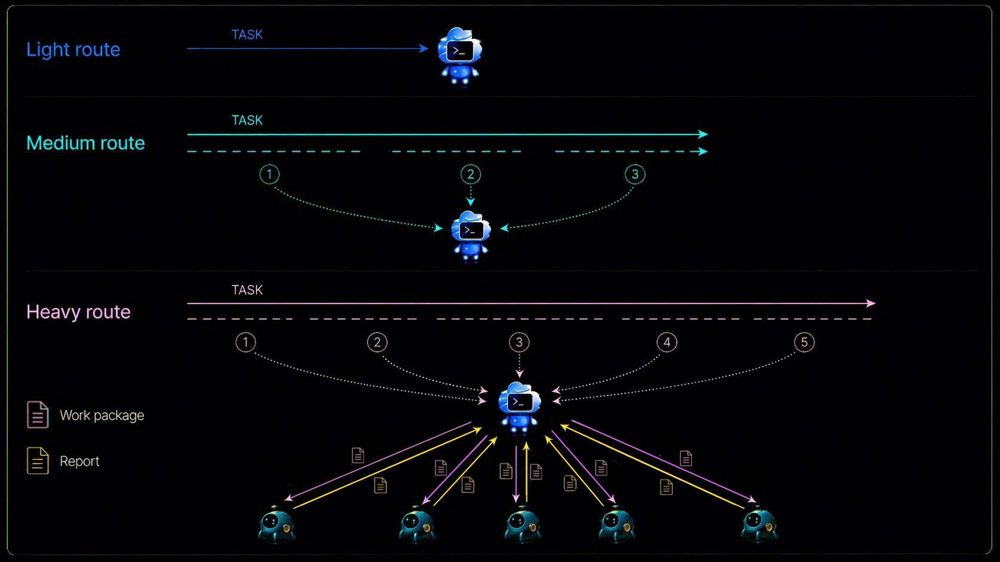

<!-- codex-workflow-version: 1.0.0 -->
<h3 align="center"><big><big><strong>SIMPLE&emsp;&emsp;───&emsp;&emsp;EASY&emsp;&emsp;───&emsp;&emsp;EFFICIENT</strong></big></big></h3>
<p align="center"><small>&nbsp;&nbsp;&nbsp;&nbsp;&nbsp;&nbsp;&nbsp;(to use)&nbsp;&nbsp;&nbsp;&nbsp;&nbsp;&nbsp;&nbsp;&nbsp;&nbsp;&nbsp;&nbsp;&nbsp;&nbsp;&nbsp;&nbsp;&nbsp;&nbsp;&nbsp;&nbsp;&nbsp;&nbsp;&nbsp;&nbsp;&nbsp;&nbsp;&nbsp;&nbsp;&nbsp;(to install)&nbsp;&nbsp;&nbsp;&nbsp;&nbsp;&nbsp;&nbsp;&nbsp;&nbsp;&nbsp;&nbsp;&nbsp;&nbsp;&nbsp;&nbsp;&nbsp;&nbsp;&nbsp;&nbsp;&nbsp;&nbsp;(token consumption)</small></p>
<p align="center"><strong>Version 1.0.0</strong></p>
<hr>



A workflow designed to drastically reduce overall token usage, extremely simple to use.

Beneath this simplicity is a tightly engineered agent orchestration system: a purpose-built documentation framework, strict responsibility boundaries, compact work-package communication, anti-stall and worker-replacement mechanisms, executor–tester repair loops, worker lifecycle management, and persistent project-state tracking. Everything is optimized to keep each agent focused on exactly what it needs.

> 💡 For lightweight tasks, it won’t overdo things. Light route is default.

> **ℹ️ Note:** project instructions and documentation are installed per project.
> Shared workflow runtime and agent definitions are stored under `~/.codex/`.


## 1. Installation ⚙️

### Open Codex CLI or the Codex app from your project directory 

▶️ Send:

```text
Download and extract the latest release package from https://github.com/viettran-edgeAI/codex_workflow/releases/latest, then read the bundled `codex_workflow/install.md` and automatically perform the complete installation process described in it. Do not read `README.md`.
```

✅ Done. The user-level workflow and the current project framework are now
installed. During this first installation, Codex can ask optional
personalization questions below.

## Configuration and personalization

During the initial release installation, Codex asks the optional workflow
questions one at a time.
The answers are stored per project in:

```text
agent_docs/workflow_personalization.md
```

The workflow procedure for recording and reapplying these decisions is stored
in `~/.codex/codex_workflow/personalization.md`. Updates reuse this record to
rebuild `AGENTS.md`, route settings, and agent configuration without asking the
same questions again.

For another project after the user-level installation is complete, open Codex in
that project and send:

```text
codex_workflow --install
```

This creates only the default project `AGENTS.md` and the main `agent_docs/`
framework. It does not reinstall the user-level workflow.

### 🔄 Restart Codex after installation

### 🧭 What is a workflow route?

This workflow has 3 routes:

- Light route: For light and medium tasks. Minimal context, no subagents, no workflow.
- Heavy route: For the deployment of heavy plans and tasks. Deploy subagents, full workflow. 
- Medium route: Coordinating multiple sub-agents for a medium-sized task can sometimes cost more tokens and be slower than letting the main agent perform the work independently. No subagents, full workflow. 

## ▶️ HOW TO USE

- Normally, for simple work or general Q&A, you don't need to do anything. `light route` is the default route.
- When starting or continuing a plan in progress, just tell Codex in the prompt: "

```text
use medium route / use heavy route. [your task description]".
```
> Codex stays on the selected route until you change it, so you don’t need to repeat it in every prompt.

> **⭐ Recommendation:** Assign very large and complex tasks to the `heavy route` to make the most of its capabilities and maximize token usage savings.

- When you want to end current session, clean up and update documents, commit, ...: 

```text
end this session. [tell Codex more details if necessary]".
```
`End-of-Session` handoff will be performed. This process updates the main document framework so that subsequent sessions can seamlessly continue the ongoing work.
> You can still continue the session after that message if needed. 

## Update the workflow 🔄

From a project already using this workflow, send:

```text
codex_workflow --update
```

The user-level workflow version and agent definitions are updated first. The current
project's personalization record and project-specific `AGENTS.md` content are
then reapplied.

## ✨ Tips for further customization

* For very large codebases, you can ask Codex to modify the workflow to use a dedicated codebase management/navigation tool such as `Graphify` instead of relying on `project_progress.md`.

* If the Luna Max subagents feel too slow, you can enable `fast_mode` for them by adding:

  `service_tier = "fast"`

  to installed files such as `~/.codex/agents/executor_luna.toml`, `~/.codex/agents/tester.toml`, etc.
  
> At the moment, the speed/usage multipliers on subscription plans are still x1.5/x2.5 rather than the x2.5/x2 in the API.

* Add custom subagents such as an `investigator` for researching solutions on the web, especially if your project is niche or highly specialized. Ask Codex to structure it consistently with the other subagents in this workflow and integrate it into `heavy_route`.

* Customize the `End-of-Session handoff` to suit your needs in `~/.codex/codex_workflow/heavy_route.md` and `~/.codex/codex_workflow/medium_route.md`.

.... 

--------------------------------------

## 🎁 BONUS · How this worflow works: a simple overview

> 📌 These things are about heavy route.

- Sol handles context, planning, task splitting, and supervision, while Luna subagents do the implementation. Each task is packaged into a small, self-contained work package with clear scope, context, and expected output, so each subagent only gets what it needs.

- Sol still reads the main documentations and the important parts of the codebase — that’s the manager’s job. In the medium and heavy routes, a single session-long explorer works alongside Sol as a read-only secretary and second brain, handling supplementary context such as tools, dependencies, external libraries, etc. It is not counted as a worker subagent. The goal is to minimize Sol’s token usage and keep it focused on the important stuff.

- For mathematically or logically demanding core work, Sol can proactively use an executor_sol from the start. It also remains a fallback when executor_luna gets stuck. This workflow still limits executor_sol to a maximum of 1.

- For handoff between sessions, project_progress.md and latest_session_work.md are managed by Sol as part of the main documentation structure. They’re there to keep long implementation plans moving smoothly across multiple sessions.

- ... etc.
